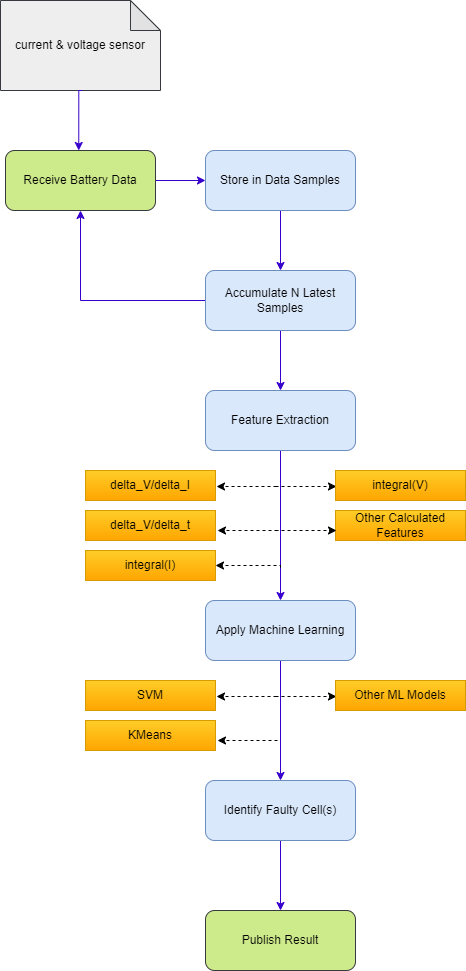

# Li Battery Diagnostic Module

The Li Battery Diagnostic Module is a cutting-edge solution engineered for the precise monitoring and analysis of Li battery packs. Tailored for electric vehicle power systems, this module plays a crucial role in ensuring the operational integrity and extending the service life of battery packs by facilitating the early detection of cells that are underperforming or exhibiting signs of potential failure.

## Module Overview

Leveraging an enhanced diagnostic algorithm, the Advanced Li Battery Diagnostic Module meticulously evaluates the health status of individual cells within a battery pack. It accepts input data that includes the overall current of the battery pack and the voltage levels of each of the 96 cells. By employing sophisticated feature extraction techniques and machine learning algorithms, the module offers a comprehensive assessment to pinpoint any cells that are malfunctioning.

## Enhanced Diagnostic Process

The module adopts a more nuanced approach to diagnostics. It incorporates a sequence of operations to analyze the battery data over time, utilizing a set of 100 consecutive data samples to perform its analysis.

### Key Features:

- **Data Aggregation**: Accumulates the latest 100 data samples for analysis, ensuring a rich dataset for accurate diagnostics.
- **Feature Extraction**: From each sample, extracts a variety of features such as `delta_V/delta_I`, `delta_V/delta_t`, `integral(I)`, `integral(V)`, and ratios involving these quantities for each of the 96 cells.
- **Machine Learning Analysis**: Applies a machine learning model, such as SVM or k-means clustering, to the extracted features to discern patterns or anomalies indicative of cell faults.

### Algorithm Workflow:

  

- **Input Data Collection**: Gathers the current of the battery pack and the voltage of each cell (96 cells in total).
  
- **Feature Extraction**:
  - Aggregates 100 sequential data samples.
  - Computes a comprehensive set of features for each cell based on the collected data.

- **Machine Learning Diagnosis**:
  - Utilizes the extracted features as input to a pre-trained machine learning model.
  - Identifies the cell(s) most likely to be faulty based on their deviation from learned patterns.

### Output:

- **Diagnostic Result**: Outputs the index of the cell(s) identified as potentially faulty, enabling targeted maintenance or further investigation.

The Li Battery Diagnostic Module represents a significant leap forward in battery health monitoring technology. By integrating complex feature analysis and machine learning into its diagnostic process, it offers an unparalleled level of precision in detecting and isolating faults within Li battery packs. This module is instrumental in enhancing the reliability and efficiency of electric vehicle power systems, contributing to longer battery life and improved vehicle performance.
